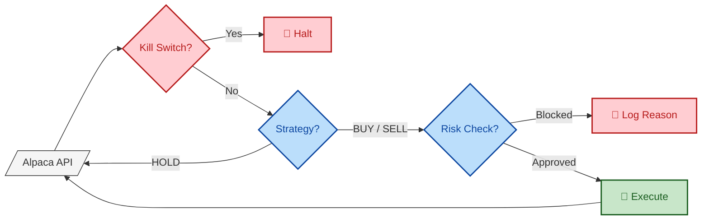

> ***Note:*** **This repository was generated by the [🍪 CookieBlueprint](https://github.com/Julien-hae/CookieBlueprint).**

# NightWatch

Night gathers, and now my watch begins. It shall not end until my portfolio dies. I shall take no emotional trades, hold no bags, chase no pumps. I shall wear no FOMO and win no glory. I shall live and die at my terminal. I am the bot in the darkness. I am the watcher on the charts. I am the shield that guards the realms of profit. I pledge my code and honor to the Night Watch, for this night and all the nights to come.

## Process (DAG)



## Getting Started

This is a basic project you can fork. So far, the only things it can do is just "Hello World" but you can call it directly in the terminal after the installation using the command `poetry run entrypoint -w World`

## Setup
### Install WSL
If not already installed, install [WSL](https://learn.microsoft.com/en-us/windows/wsl/install).
Once thise is done make sure you run the following command

```shell
 # Update the package index and install the build-essential packace (C/C++ compiler, Make, Librariey like libc6-dev, etc):
sudo apt update
sudo apt install -y make build-essential libssl-dev zlib1g-dev libbz2-dev libreadline-dev libsqlite3-dev wget curl llvm libncursesw5-dev xz-utils tk-dev libxml2-dev libxmlsec1-dev libffi-dev liblzma-dev
```
### Install Python
If not already installed, install Python. The recommended way is to use [pyenv](https://github.com/pyenv/pyenv), which allows multiple parallel Python installations which can be automatically selected per project you're working on.

```shell
# Install Python if necessary
pyenv install 3.11
pyenv shell 3.11
```
### Install Poetry
If not already installed, get Poetry using pipx according to <https://python-poetry.org/docs/#installation>. If your are new to Poetry, you may find <https://python-poetry.org/docs/basic-usage/> interesting.

### Create Environment
Execute the following in a terminal:
```shell
# Create venv and install all dependencies
make

# Cleanup venv
make clean
```
Do not forget to activate your virtualenv when done with the makefile

## Usage

## Contents and Concepts

At first glance one may be overwhelmed by the amount of files and folders present in this directory. This is mainly due to the fact, that each tool uses its own configuration file. The situation has improved with more and more tools adding support for pyproject.toml. The following two tables describe the main structure of the project:

| Folder | Purpose |
|--------|-----|
| `.venv` | This is where the Poetry-managed venv lives. |
| `.vscode` | This is where settings for vscode live. Some useful defaults are added in case you use vscode in your project. If not, this can savely be deleted.|
| `src` | Main directory for the python code. Most of the times this will contain one subfolder with the main module of the project.  `Nightwatch` in our case. Replace this with your own module-name. |
| `tests` | Directory containing all tests. This directory will be scanned by the test-infrastructure to find testcases. |

| File                      | Purpose |
|---------------------------|---------|
| `.gitattributes`           | Attributes for git are defined in this file, such as automatic line-ending conversion. |
| `.gitignore`               | This file contains a list of path patterns that you want to ignore for git (they will never appear in commits). |
| `.pre-commit-config.yaml`  | This file contains configuration for the pre-commit hook, which is run whenever you `git commit`, you can configure running code quality tools and tests here. |
| `poetry.toml`              | Configuration for Poetry. |
| `pyproject.toml`           | This file contains meta information for your project, as well as a high-level specification of the dependencies of your project, from which Poetry will do its dependency resolution and generate the `poetry.lock`. Also, it contains some customization for code-quality tools. Check [PEP 621](https://peps.python.org/pep-0621/) for details.|
| `README.md`                | This file. Document how to develop and use your application in here. |

## Environment Variable

The following environment variables may be used to configure  `Nightwatch`:

| Environment Variable | Purpose | Default Value | Allowed Values |
|----------------------|-|-|-|
| LOG_LEVEL            | Sets the default log level [here](src/Nightwatch/common/logging_configuration.py). | "INFO" | See [Python Standard Library API-Reference](https://docs.python.org/3/library/logging.html#logging-levels) |
